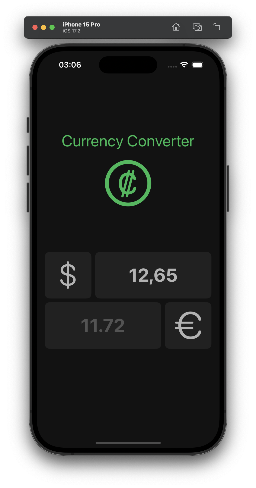

&nbsp;&nbsp;&nbsp;&nbsp;&nbsp;&nbsp;&nbsp;&nbsp;
&nbsp;&nbsp;&nbsp;&nbsp;&nbsp;&nbsp;&nbsp;&nbsp;

# Currency Converter

Currency Converter is an intuitive iOS app developed using SwiftUI, designed to simplify currency conversions effortlessly. As the name suggests, users can utilize this app to convert a specified amount from one currency to another.

## Features

- **User-Friendly Interface:** Users can easily tap on the currency icons to select their current currency and the target currency for conversion.

- **Wide Currency Support:** The app provides access to 16 different currencies, offering a broad range of options for users.

- **Real-time Target Currency Update:** The target currency dynamically updates in real-time with each input, allowing users to see instant conversions.

- **Exchange Rates API Integration:** Exchange rates for all available currencies are set with the base currency being USD. The entered amount is converted to the target currency by considering the latest exchange rates, ensuring accuracy in calculations.

## How to Use

1. **Launch the App:** Open Currency Converter on your iOS device.

2. **Currency Selection:** Tap the first currency icon to access available currencies. Select your current currency from the list. Use the second currency icon to choose the target currency.

3. **Input Amount:** Tap the first empty text box to input the amount you wish to convert.

4. **View Conversion:** The converted amount is displayed in the second text box, providing the equivalent value in the selected target currency.

